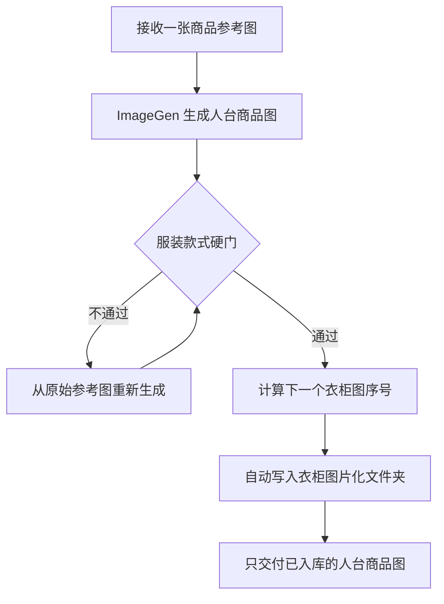

# 模块 05：衣柜图片化

## 1. 职责与边界

本模块是一条独立于正式日更主链的服装图片资产化流程。它只完成一件事：根据用户提供的商品参考图，生成一张服装穿在无头、中性、哑光展示人台上的标准电商商品图。

模块最终只交付并入库这张人台商品图，不生成人物穿搭图，不调用任何后续换装执行器，不进行人物相关质检，也不保存商品原图、候选图、代理图、prompt、JSON 记录或款式子目录。

本模块当前不接入模块 01–04，不触发 xdy、xdysp、Dreamina 视频生成、Google Drive 或平台发布，也不修改 `DOCS/PROJECT.md`、README、`MATERIAL/anna-wardrobe.md`、正式日更双图合同、日更 prompt 或校验器。

## 2. 主链



每次生成和重试都必须以用户本次提供的原始参考图为唯一图片输入。失败结果不得作为下一版输入，不得串行派生。

## 3. 输入合同

- 必须由用户本次提供一张商品参考图；不得从旧运行目录、历史会话或衣柜文件夹自行选图。
- 参考图是服装事实的唯一来源。附加文字只用于明确目标组件或补充参考图中已经可见的服装事实，不得凭文字新增设计。
- 截图中的真人身份、脸部、头发、妆容、身材、姿势、手机、界面、账号信息、文字、场景和道具均不属于服装事实。
- 目标是参考图中可见的整套服装。上装、下装、裙装、领带、腰带、丝袜或其他明确构成穿搭的服装组件都必须完整保留；手机、首饰、包、鞋或其他非服装物品仅在用户明确要求其属于目标商品时纳入。
- 原图不足以确认正面核心结构或无法判断目标服装组件时停止生成，请用户补充参考图或说明，不能让模型自行推断核心款式。

## 4. 生成合同

### 4.1 执行器

固定使用 `$imagegen` 技能的内置 `image_gen` 工具。参考图是服装参考，不是需要保留人物或场景的编辑底图。

默认每轮只生成一张。结果未通过质检时，重新以原始参考图和同一基础 prompt 独立生成；只允许在基础 prompt 末尾追加一条针对当前款式错误的中性服装事实，不得使用失败图片作为输入。

### 4.2 固定基础 prompt

```text
根据参考图中的服装，生成一张标准电商服装商品图。将整套服装穿在无头、中性、哑光的服装展示人台上；人台正面自然站立，只用于撑出版型，不具有脸部、头发、妆容或真人身份特征。准确保留参考图中可见的服装组件、颜色、版型、领口或肩带、层次、开合、腰线、裙裤轮廓、长度、图案、面料观感、褶皱和袜类结构。使用白色或浅灰色干净背景，完整、清晰地展示同一套服装。不要添加文字、品牌、参数、装饰、手机、界面、场景道具或参考图中没有的设计。
```

### 4.3 输出要求

- 画面中只能有一套服装和一个无头中性展示人台。
- 人台采用哑光白色或浅灰色，正面自然站立，只负责撑出版型，不得具有脸部、头发、妆容、肤色纹理或其他真人身份特征。
- 目标服装组件必须全部穿在人台上并完整可见。若包含长裤、长裙、长筒袜或其他下半身组件，必须使用足以完整展示全部组件的全身构图。
- 背景固定为干净白色或浅灰色，采用均匀柔和的标准电商棚拍光线；允许不抢主体的轻微落地阴影。
- 不得出现文字、品牌、参数、水印、手机、界面、场景道具、衣架、货架、装饰或参考图中没有的服装设计。

## 5. 服装款式硬门

生成结果必须逐项对照原始参考图，只检查人台商品图本身：

1. 组件：参考图中属于目标穿搭的服装组件是否全部存在。
2. 款式：品类、颜色、领口或肩带、袖型、层次、开合、腰线、裙裤轮廓和长度是否一致。
3. 细节：图案、面料观感、褶皱、缝线、蕾丝、透明度、光泽和袜类结构是否对应可见证据。
4. 展示：服装是否完整清晰，人台是否正确撑出版型且没有遮挡、吞并或改变服装结构。
5. 禁止项：是否出现真人特征、文字、品牌、参数、手机、界面、场景道具或新增设计。

任一项不通过时不得入库。必须丢弃当前结果，从原始参考图重新生成；下一轮只针对已确认的单一款式错误补充一句中性约束。只有全部通过的图片才能进入自动入库。

## 6. 自动入库与命名

正式衣柜图片化目录固定为：

```text
MATERIAL/wardrobe-images/
```

目录采用纯图片平铺结构，只允许保存最终通过质检的人台商品图：

```text
MATERIAL/wardrobe-images/
├── 衣柜图-001.png
├── 衣柜图-002.png
└── 衣柜图-003.png
```

入库规则：

- 每张通过质检的人台商品图立即自动入库，无需二次确认。
- 仅识别完全匹配 `衣柜图-NNN.png` 的正式文件，其中 `NNN` 是三位十进制序号。
- 空目录从 `衣柜图-001.png` 开始；已有图片时取现有最大序号加一，不回填缺号、不复用已删除编号。
- 序号只在商品图通过质检后分配；失败候选不占号。
- 目标文件已存在时必须停止写入并重新扫描，禁止覆盖、替换或原地修改任何已入库图片。
- 正式目录不得写入原始参考图、候选图、代理图、临时文件、隐藏记录、JSON、Markdown、prompt 或子目录。
- ImageGen 默认生成缓存位于项目外，不属于正式衣柜资产；通过质检后将最终图片复制到上述正式路径，保留工具默认缓存的正常行为。

若序号已经达到 `999`，停止入库并报告命名空间已满；在用户明确修改命名合同前不得自动改为四位序号。

## 7. 最终交付

入库成功后，最终回复只交付已入库的人台商品图，使用本地绝对路径的 Markdown 图片：

```markdown

```

最终回复不再附加原始参考图、候选图、代理图、prompt、模型状态、质检说明、路径列表或其他文字。工具预览不算交付，必须在正文使用 Markdown 图片。

## 8. 硬阻断

出现以下任一情况时不得入库或交付：

- 用户本次未提供商品参考图。
- 原始参考图不足以确认正面核心结构或目标服装组件。
- 生成结果未通过任一服装款式硬门。
- 生成或重试使用了失败候选，而不是原始参考图。
- 结果出现真人身份特征、文字、品牌、参数、手机、界面、场景道具或新增设计。
- 正式目录中准备写入的目标编号已经存在。
- 正式目录准备写入最终商品图以外的文件或子目录。
- 序号超过三位编号合同允许的范围。

## 9. 与正式日更主链的关系

正式日更主链及其分支以 `DOCS/PROJECT.md` 为唯一事实源。本模块当前仍未接入正式日更主链；新入库的人台商品图不会自动改变衣柜选择、Dreamina 输入、日更 prompt、视频生成或发布流程。
