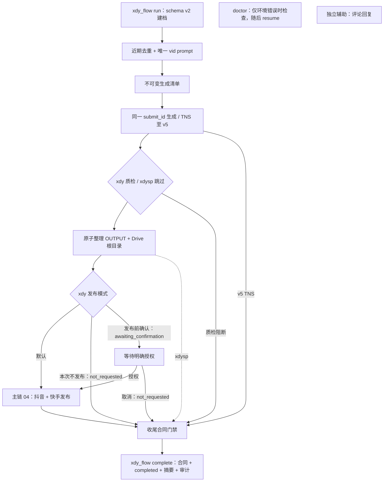

## 规则

- README 只保留简短 DAG。
- 流程变化后及时更新 DAG。

```mermaid
flowchart TD
  A["xdy_flow run：schema v2 建档"] --> C["近期去重 + 唯一 vid prompt"]
  C --> P["不可变生成清单"]
  P --> D["同一 submit_id 生成 / TNS 至 v5"]
  D --> Q{"xdy 质检 / xdysp 跳过"}
  Q --> U["原子整理 OUTPUT + Drive 根目录"]
  U --> G{"xdy 发布模式"}
  G -- "默认" --> E["主链 04：抖音 + 快手发布"]
  G -- "本次不发布：not_requested" --> F["收尾合同门禁"]
  G -- "发布前确认：awaiting_confirmation" --> H["等待明确授权"]
  H -- "授权" --> E
  H -- "取消：not_requested" --> F
  E --> F
  U -. "xdysp" .-> F
  D -- "v5 TNS" --> F
  Q -- "质检阻断" --> F
  F --> R["xdy_flow complete：合同 + completed + 摘要 + 审计"]
  X["doctor：仅环境错误时检查，随后 resume"]
  Y["独立辅助：评论回复"]
```
