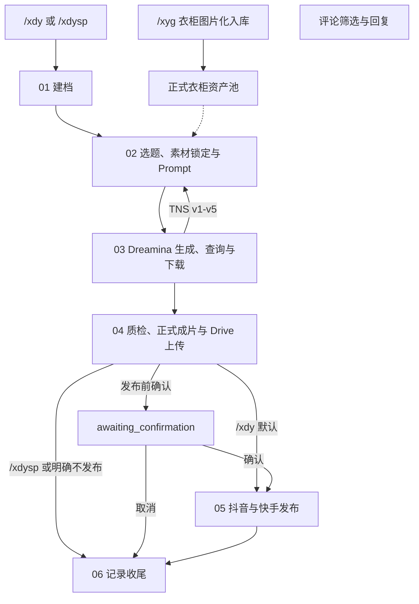

# dy

Anna 三图参考短视频生成、上传与双平台发布项目。完整合同与硬阻断以 [DOCS/PROJECT.md](DOCS/PROJECT.md) 为准。

```mermaid
flowchart TD
  A["/xdy 或 /xdysp"] --> P1["01 建档"]
  P1 --> P2["02 选题、素材锁定与 Prompt"]
  P2 --> P3["03 Dreamina 生成、查询与下载"]
  P3 -->|"TNS v1-v5"| P2
  P3 --> P4["04 质检、正式成片与 Drive 上传"]
  P4 -->|"/xdy 默认"| P5["05 抖音与快手发布"]
  P4 -->|"/xdysp 或明确不发布"| P6["06 记录收尾"]
  P4 -->|"发布前确认"| H["awaiting_confirmation"]
  H -->|"确认"| P5
  H -->|"取消"| P6
  P5 --> P6

  W["/xyg 衣柜图片化入库"] --> S["正式衣柜资产池"]
  S -.-> P2
  C["评论筛选与回复"]
```

任一阶段出现环境问题时读取 `DOCS/RUNBOOKS/ENVIRONMENT_REPAIR.md`，修复后返回原失败点；衣柜和评论工作流不自动进入视频主链。
