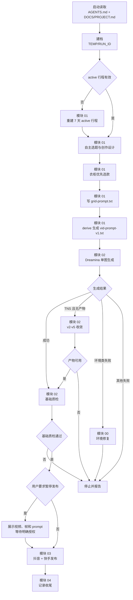

# dy

`/Users/Shared/codex/dy` 是 `anna auto/fast` 双平台日更项目。

## DAG


```mermaid
flowchart TD
  A["启动读取<br/>AGENTS.md + DOCS/PROJECT.md"] --> B["建档<br/>TEMP/RUN_ID"]
  B --> C{"active 行程有效"}
  C -- "否" --> C1["模块 01<br/>重建 7 天 active 行程"]
  C -- "是" --> D["模块 01<br/>自主选题与创作设计"]
  C1 --> D
  D --> E["模块 01<br/>衣柜优先选款"]
  E --> F["模块 01<br/>写 grid-prompt.txt"]
  F --> G["模块 01<br/>derive 生成 vid-prompt-v1.txt"]
  G --> H["模块 02<br/>Dreamina 单图生成"]
  H --> I{"生成结果"}
  I -- "成功" --> J["模块 02<br/>基础质检"]
  I -- "TNS 且无产物" --> K["模块 02<br/>v2-v5 收敛"]
  I -- "环境类失败" --> L["模块 00<br/>环境修复"]
  I -- "其他失败" --> M["停止并报告"]
  K --> N{"产物可用"}
  N -- "是" --> J
  N -- "否" --> M
  L --> M
  J --> O{"基础质检通过"}
  O -- "否" --> M
  O -- "是" --> P{"用户要求暂停发布"}
  P -- "是" --> Q["展示视频、帧和 prompt<br/>等待明确授权"]
  P -- "否" --> R["模块 03<br/>抖音 + 快手发布"]
  Q --> R
  R --> S["模块 04<br/>记录收尾"]
```

## 入口

```bash
cd /Users/Shared/codex/dy
```

启动和协作边界见 `AGENTS.md`；项目核心事实、流程路由和硬阻断见 `DOCS/PROJECT.md`。
